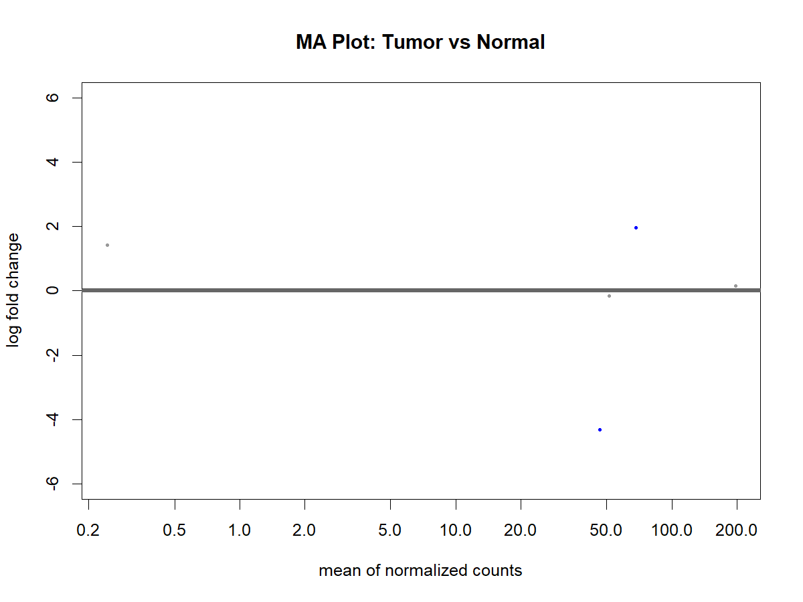
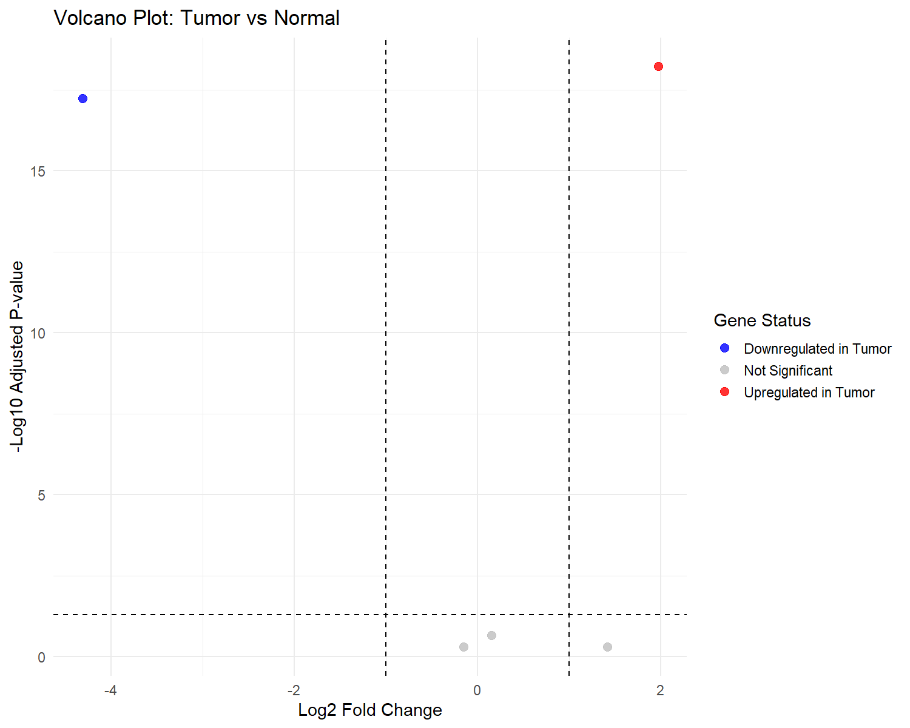
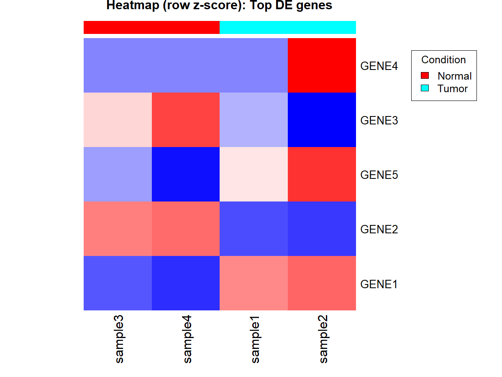

# RNA-seq Differential Expression Analysis (Tumor vs Normal)

## Project Overview

This project demonstrates a complete RNA-seq differential gene expression analysis
pipeline comparing **Tumor** and **Normal** samples using the **DESeq2** framework.

A small toy dataset is intentionally used to illustrate best practices for
normalization, dispersion estimation, statistical testing, and visualization
in a fully reproducible workflow. Although the dataset is small, the analysis
mirrors the structure and logic used in real RNA-seq studies.

---

## Goals

- Perform differential gene expression analysis (Tumor vs Normal)
- Identify significantly upregulated and downregulated genes
- Generate standard RNA-seq visualizations:
  - MA plot
  - Volcano plot
  - Principal Component Analysis (PCA)
  - Heatmap of top differentially expressed genes
- Build a clean, reproducible, and well-documented RNA-seq analysis pipeline

---

## Tools and Methods

- **R / Bioconductor**
  - DESeq2 (differential expression analysis)
- **Visualization**
  - ggplot2
  - pheatmap
- **Development Environment**
  - Visual Studio Code

---

## Project Structure

RNASEQ_CANCER_PROJECT/
├── data/
│   ├── counts.tsv
│   └── metadata.tsv
├── scripts/
│   └── deseq2/
│       └── 03_deseq2.R
├── results/
│   ├── tables/
│   │   └── deseq2_results.tsv
│   └── figures/
│       ├── ma_plot.png
│       ├── volcano_plot.png
│       ├── pca_plot.png
│       └── heatmap_top_genes.png
└── README.md


## How to Run

### Requirements
- **R (≥ 4.2)**
- **Bioconductor**
- R packages:
  - `DESeq2`
  - `ggplot2`
  - `pheatmap`
  - `dplyr`
  - `tibble`

If Bioconductor is not installed:
```r
install.packages("BiocManager")
BiocManager::install("DESeq2")
Install remaining CRAN packages:

install.packages(c("ggplot2", "pheatmap", "dplyr", "tibble"))
Input Data
The pipeline expects the following input files:

data/counts.tsv

Gene-level raw RNA-seq count matrix

Rows = genes

Columns = samples

data/metadata.tsv

Sample metadata table containing:

sample_id

condition (Tumor or Normal)

Important: Sample IDs must exactly match the column names in counts.tsv.

Run the Analysis
From the project root directory, start R and run:

source("scripts/deseq2/03_deseq2.R")
The script executes the full RNA-seq differential expression workflow:

Data loading and validation

Normalization and dispersion estimation

Differential expression testing (Wald test)

Figure generation

Results table export

Output Files
Tables
results/tables/deseq2_results.tsv
Differential expression results including:

Log2 fold change

Wald test statistic

Raw p-value

Adjusted p-value (FDR)

Categorical significance labels

Figures
results/figures/ma_plot.png

results/figures/volcano_plot.png

results/figures/pca_plot.png

results/figures/heatmap_top_genes.png

Notes
This analysis uses a toy dataset with a small number of genes and samples.

Statistical results are for demonstration purposes only.

The pipeline structure mirrors real RNA-seq workflows and can be scaled to
full datasets with minimal modification.
---

## Methods

### Data Input
Gene-level RNA-seq count data were provided as a tab-delimited matrix (`counts.tsv`), where rows correspond to genes and columns correspond to samples. Sample metadata (`metadata.tsv`) included sample identifiers and biological condition labels (Tumor or Normal).

Sample ordering between the count matrix and metadata was explicitly matched to ensure correct alignment prior to analysis.

---

### Differential Expression Analysis
Differential gene expression analysis was performed in **R** using the **DESeq2** Bioconductor package. Raw counts were normalized using DESeq2’s size factor estimation to account for differences in sequencing depth across samples.

Because this project uses a **very small toy dataset**, DESeq2’s default dispersion trend fitting can fail. To ensure the pipeline runs end-to-end while preserving statistical validity, **gene-wise dispersion estimates were used directly**, and differential expression was assessed using the Wald test.

For real RNA-seq datasets, the standard `DESeq()` workflow would be applied without modification.

---

### Statistical Testing
Differential expression between Tumor and Normal samples was assessed using the **Wald test**. The results include:

- Log2 fold change (Tumor vs Normal)
- Wald test statistic
- Raw p-value
- Benjamini–Hochberg adjusted p-value (false discovery rate, FDR)

Genes were categorized as:
- **Upregulated in Tumor**
- **Downregulated in Tumor**
- **Not Significant**

## Results

### Differential Gene Expression Overview
Differential expression analysis was performed using **DESeq2** to compare Tumor versus Normal samples. Despite the small toy dataset size, normalization and dispersion estimation were completed successfully, and Wald testing was used to assess differential expression. The results table includes log2 fold changes, raw p-values, adjusted p-values (FDR), and categorical significance labels.

---

### Figure 1. MA Plot
The MA plot displays log2 fold change versus mean normalized expression for Tumor vs Normal samples. Most genes cluster around a log2 fold change of zero, indicating stable expression, while a small subset of genes shows strong differential expression.

**Interpretation:**
- Most genes are not differentially expressed (expected)
- A subset of genes shows strong up- or down-regulation
- Normalization behaves as expected


---

### Figure 2. Volcano Plot
The volcano plot visualizes log2 fold change versus −log10 adjusted p-value. Significantly upregulated genes in tumor samples are shown in red, while significantly downregulated genes are shown in blue.

**Interpretation:**
- Combines effect size and statistical significance
- Clearly separates upregulated and downregulated genes
- Confirms directionality of expression changes


---

### Figure 3. Principal Component Analysis (PCA)
PCA was performed on log2-normalized expression values to assess global expression patterns. Samples cluster according to biological condition along the first principal component (PC1), which explains the majority of variance in the dataset.

**Interpretation:**
- Samples separate by biological condition
- Condition is the dominant source of variance
- No obvious sample mislabeling or outliers  
- Serves as a key quality control step


---

### Figure 4. Heatmap of Top Differentially Expressed Genes
A heatmap was generated using row-scaled (z-score) expression values for the top differentially expressed genes. Rows represent genes and columns represent samples.

**Interpretation:**
- Differentially expressed genes show consistent expression patterns
- Tumor and Normal samples cluster separately
- Gene-level patterns align with PCA and differential expression results


---

### Overall Interpretation
Together, the MA plot, volcano plot, PCA, and heatmap provide consistent and complementary evidence of differential gene expression between Tumor and Normal samples. While this analysis uses a small toy dataset, it demonstrates a complete, reproducible RNA-seq differential expression workflow suitable for extension to real RNA-seq data.

## Reproducibility

All analyses are fully scripted and deterministic.
Running the DESeq2 script with the same input data will reproduce all results and figures exactly.

##  Future Work and Extensions

This project was designed as a demonstration of a complete RNA-seq differential
expression workflow using a small toy dataset. The pipeline can be directly
extended to real RNA-seq datasets with minimal modification.

Planned extensions include:

- **Scaling to real RNA-seq datasets**
  - Increase sample size to improve statistical power
  - Use DESeq2’s standard `DESeq()` workflow with dispersion trend fitting
  - Incorporate biological replicates and covariates

- **Enhanced preprocessing**
  - Integrate quality control using FastQC and MultiQC
  - Add transcript-level quantification with `tximport`
  - Support gene annotation and ID conversion (e.g., Ensembl ↔ gene symbols)

- **Advanced analysis**
  - Perform batch effect correction when appropriate
  - Extend to multifactor experimental designs
  - Identify pathway-level changes using gene set enrichment analysis (GSEA)

- **Reproducibility and portability**
  - Package the pipeline as an R project or workflow
  - Add containerization (Docker/Singularity) for full environment reproducibility
  - Automate execution using workflow managers (Snakemake or Nextflow)

These extensions would allow the pipeline to transition from a demonstration
workflow to a production-ready RNA-seq analysis framework.
